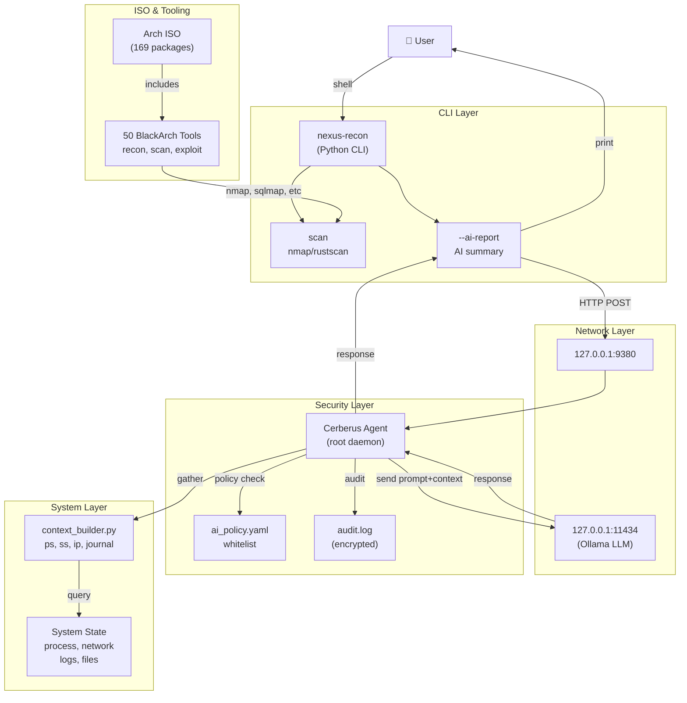
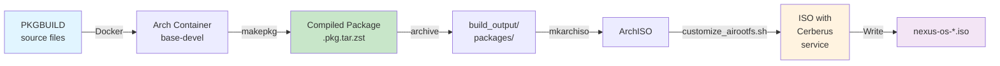
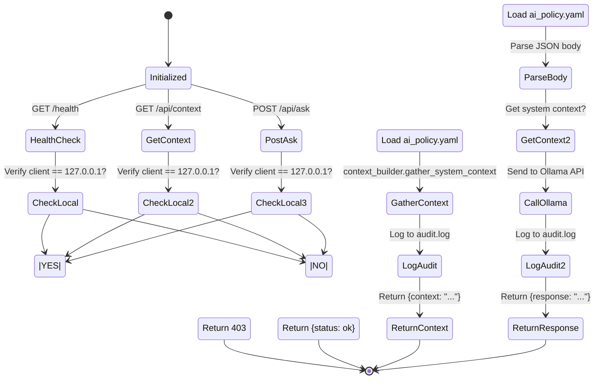
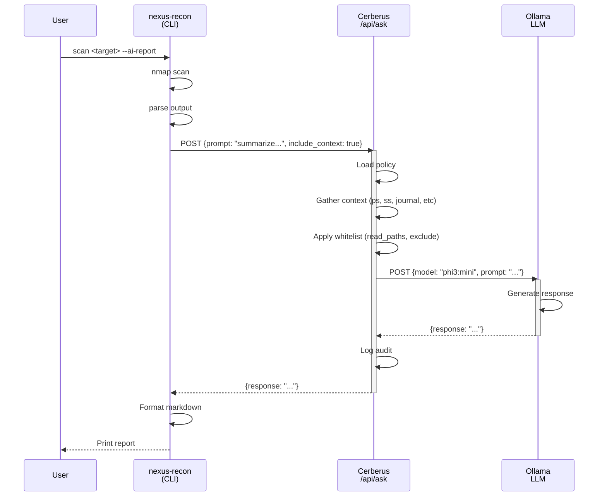
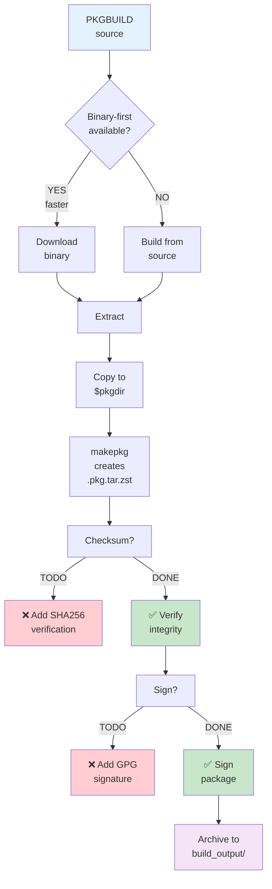
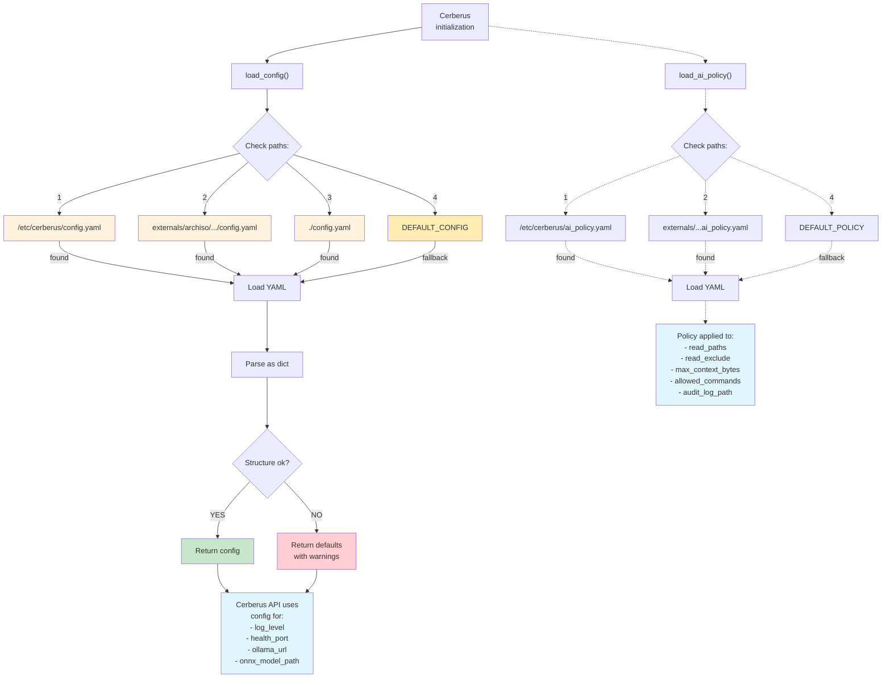
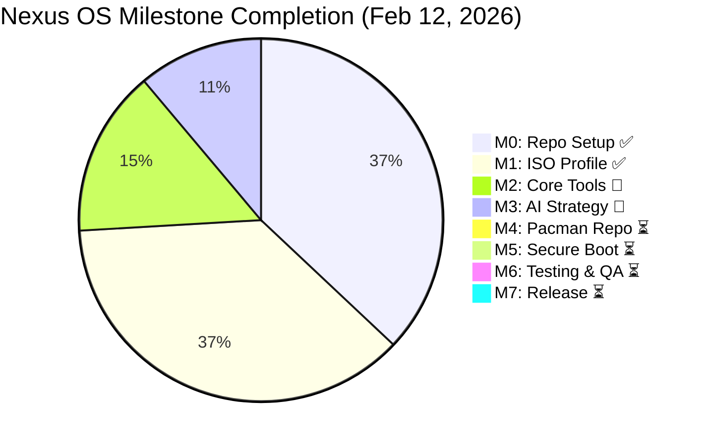
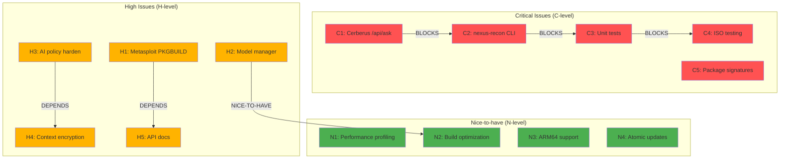
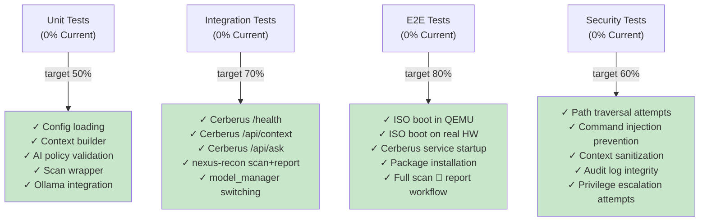

# Component Interaction Diagram

## System Architecture (Mermaid)



## Build Pipeline



## Cerberus API State Machine



## Data Flow: nexus-recon → Cerberus → Ollama



## Security Control Flow

```mermaid
graph TB
    Audit["Every /api/context<br/>or /api/ask call"]
    
    Audit --> Check1{"Is client<br/>127.0.0.1?"}
    Check1 -->|NO| Deny["❌ Deny (403)"]
    Check1 -->|YES| Check2{"Is endpoint<br/>whitelisted?"}
    
    Check2 -->|NO| Deny
    Check2 -->|YES| Check3{"Load<br/>ai_policy.yaml"}
    
    Check3 --> Check4{"deep_system<br/>_access=true?"}
    Check4 -->|NO| Deny
    Check4 -->|YES| Check5{"Gather<br/>context"}
    
    Check5 --> Filter["Apply filters:<br/>read_paths<br/>read_exclude<br/>max_context_bytes"]
    
    Filter --> Sanitize["Sanitize:<br/>mask IPs/PHI?<br/>remove secrets?"]
    
    Sanitize --> Send["✅ Send to LLM<br/>or return"]
    
    Send --> AuditLog["📝 Log to:<br/>ai_audit.log<br/>encrypted"]
    
    Deny --> DenyAudit["⚠️ Log denied<br/>attempt"]
    
    DenyAudit --> [*]
    AuditLog --> [*]
    
    style Deny fill:#ffcdd2
    style Send fill:#c8e6c9
    style AuditLog fill:#e1f5ff
```

## Package Build Dependency Graph



## Configuration Management Flow



## Milestone Completion Status



## Risk Priority Heat Map



---

## Testing Coverage Map



