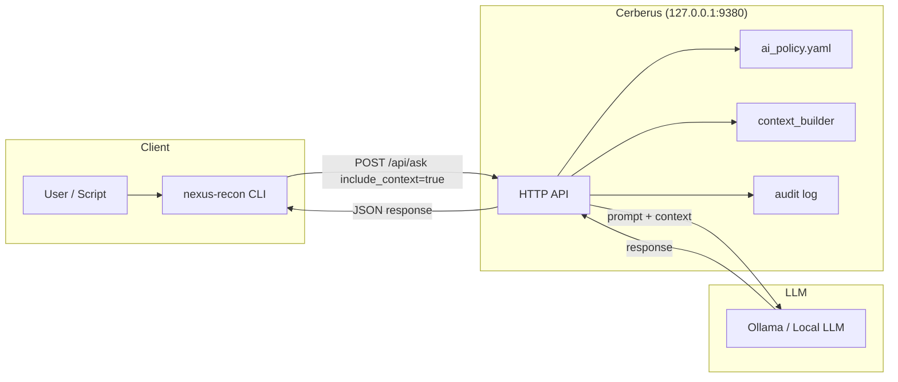
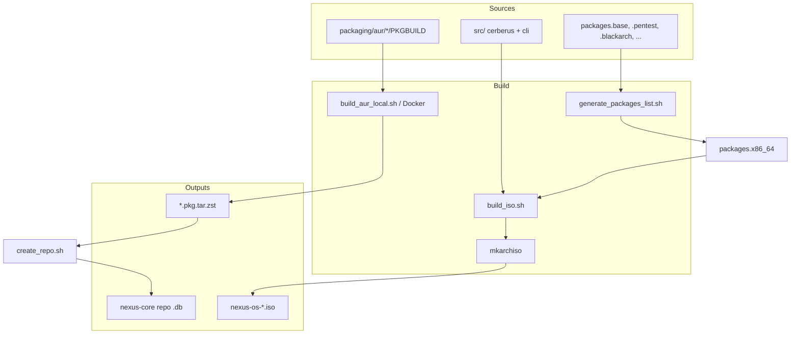
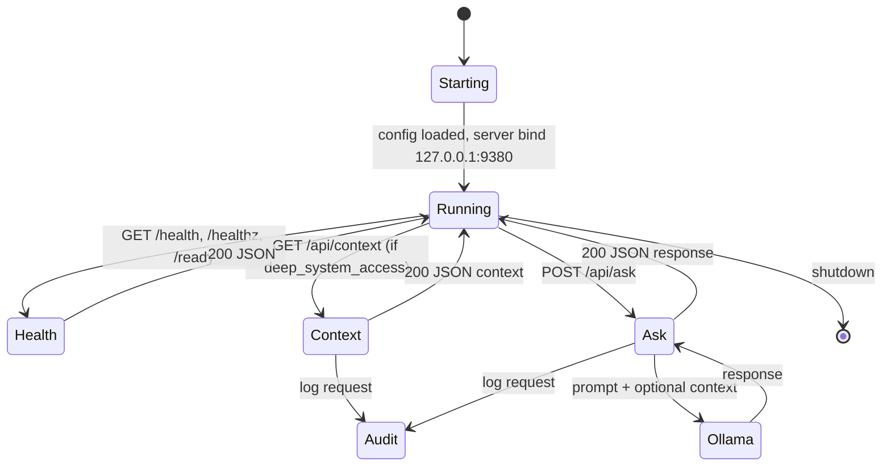
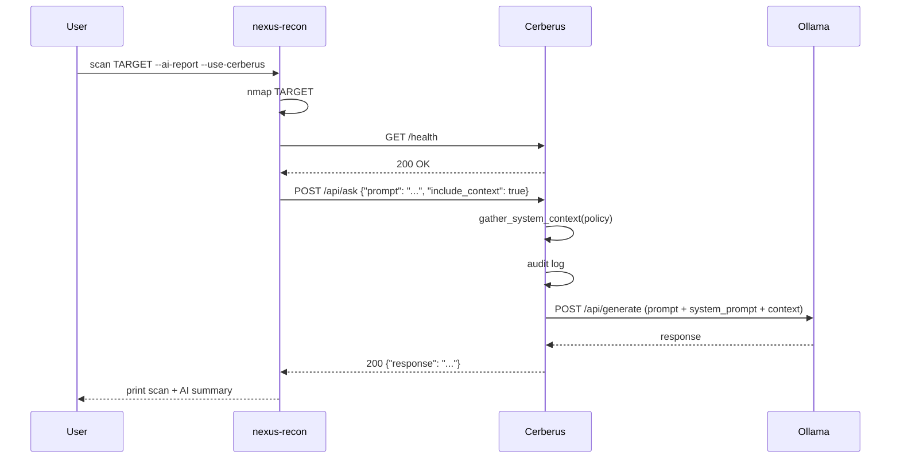
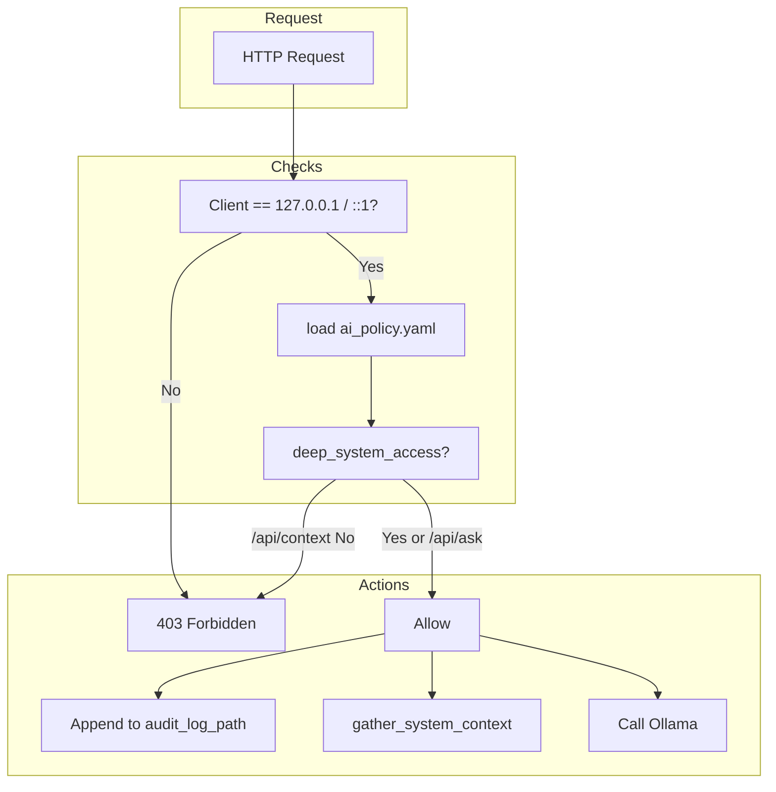
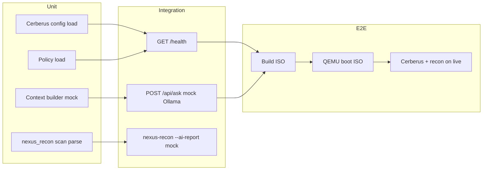

# Nexus OS — Sơ Đồ Kiến Trúc (Mermaid)

6 diagram minh họa kiến trúc hệ thống, pipeline build, Cerberus API, luồng dữ liệu, bảo mật và phạm vi test.

---

## 1. System architecture (Client → Cerberus → Ollama)

---

## 2. Build pipeline (PKGBUILD → Docker → ISO)

---

## 3. Cerberus state / API endpoints

---

## 4. Data flow: nexus-recon → Cerberus → Ollama

---

## 5. Security control flow (policy + audit)

---

## 6. Testing coverage map (mục tiêu)

---

*Các diagram dùng Mermaid; có thể render trong GitHub, GitLab hoặc VS Code (Markdown Preview Mermaid).*
